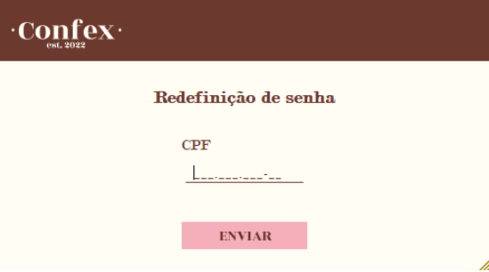
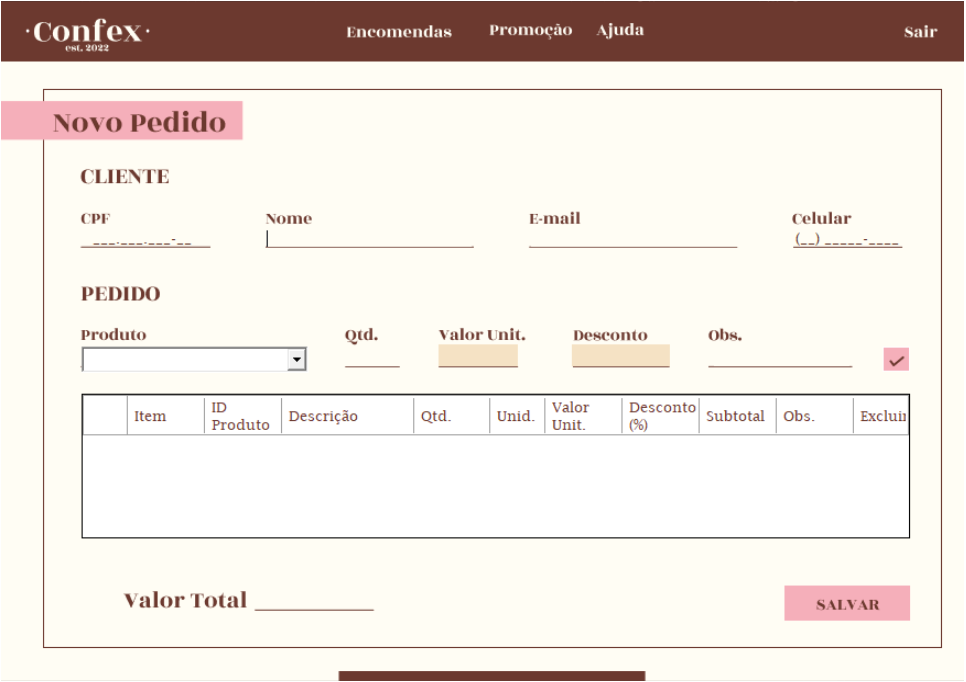
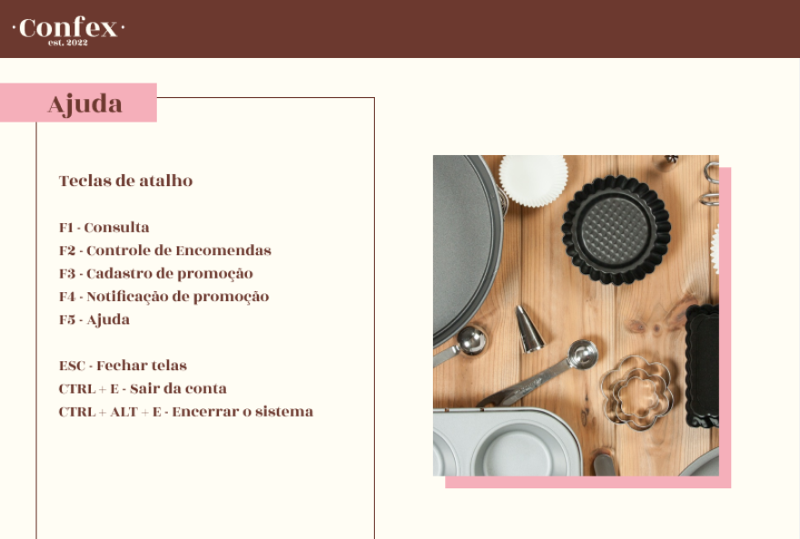
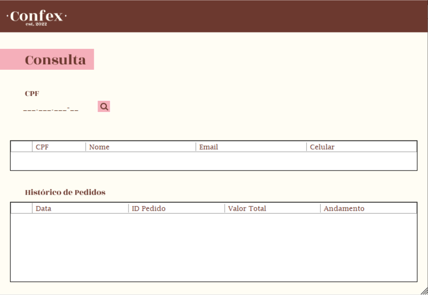
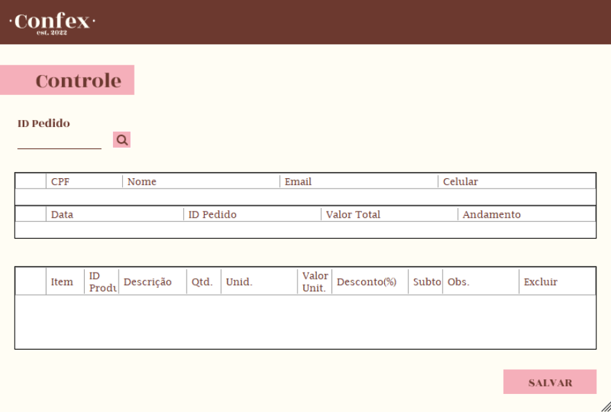
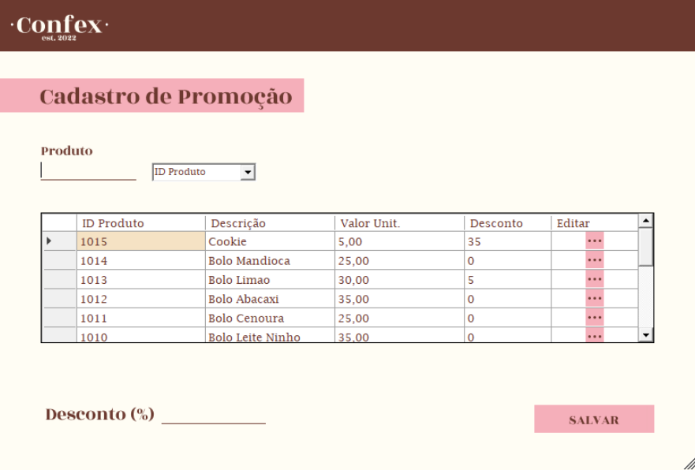
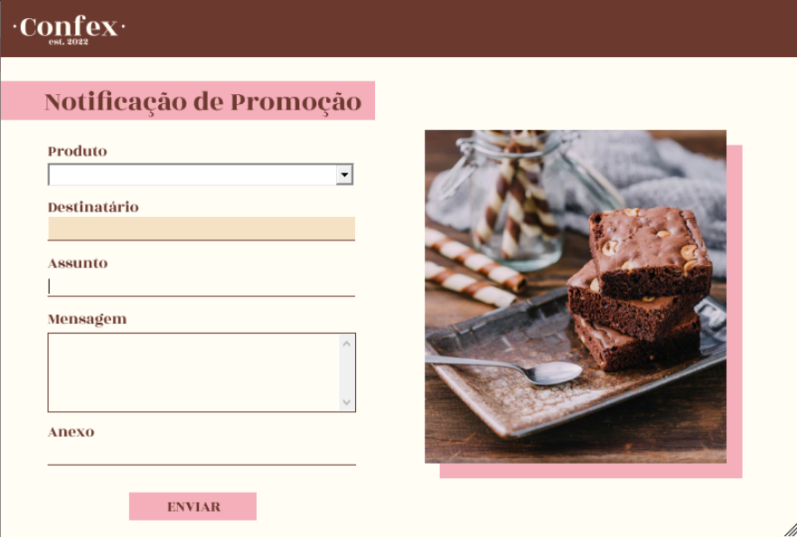

<h1 align="center">
    
</h1>

<h1 align="center">
   🍰 <a href="#"> ORDERING MANAGEMENT SYSTEM </a> 🍰
</h1>

<h3 align="center">
    Confex - Mnagement System and Ordering Control.  
</h3>

     

<h4 align="center"> 
	 Status: Finished
</h4>

 <a href="#about">About</a> •
 <a href="#features">Features</a> •
 <a href="#layout">Layout</a> • 
 <a href="#contributors">Contributors</a> • 
 <a href="#author">Author</a> 

## About

This management system was made for an university integrated project from the subjects: Systems Information, Software Engineering and Human Computer Interaction.

---

## Features

- [x] User authentication:
   - [x] Access through ID and password
   - [x] 3 attempts limit
   - [x] Reset password

- [x] Customers:
   - [x] Search of registered customer's information
   - [x] Update customer's information
   - [x] Register new customer

- [x] Orders:
   - [x] Register new order
   - [x] Remove an order item
   - [x] Consultation of customer's order
   - [x] Update order status
   - [x] Send e-mail of finished order

- [x] Sale:
   - [x] Register product sale
   - [x] Update product sale information
   - [x] Send sale e-mail

---

## Layout

  

  

  
	
  

  
  
  

  

  

---

## Contributors

A big thanks to this group that made this product a success :)

Programming:
 Bruna Silvestre do Nascimento
 Camilla Naomy Tsuda
 Isabele Alves de Moura

Design:
 Camilla Naomy Tsuda

<table>
  <tr>
    <td align="center"><a href="https://github.com/t09352021"> <b>Bruna Silvestre do Nascimento</b></a> 
	<a href="https://www.linkedin.com/in/brunasilvestrenascimento/"><b>LinkedIn</b></a> </td>
    <td align="center"><a href="https://github.com/naomy19"> <b>Camilla Naomy Tsuda</b></a> 
        <a href="https://www.linkedin.com/in/camilla-naomy-tsuda-33839b133/"><b>LinkedIn</b></a> </td>
    <td align="center"><a href="https://github.com/isabelemoura"> <b>Isabele Alves de Moura</b></a> 
        <a href="https://www.linkedin.com/in/isabelealves/"><b>LinkedIn</b></a> </td>
    
  </tr>
</table>

## How to contribute

1. Fork the project.
2. Create a new branch with your changes: `git checkout -b my-feature`
3. Save your changes and create a commit message telling you what you did: `git commit -m" feature: My new feature "`
4. Submit your changes: `git push origin my-feature`
> If you have any questions check this [guide on how to contribute](./CONTRIBUTING.md)

---

##  Versions of README

[English](./README.md)  |  [Portuguese](./README-pt.md)
